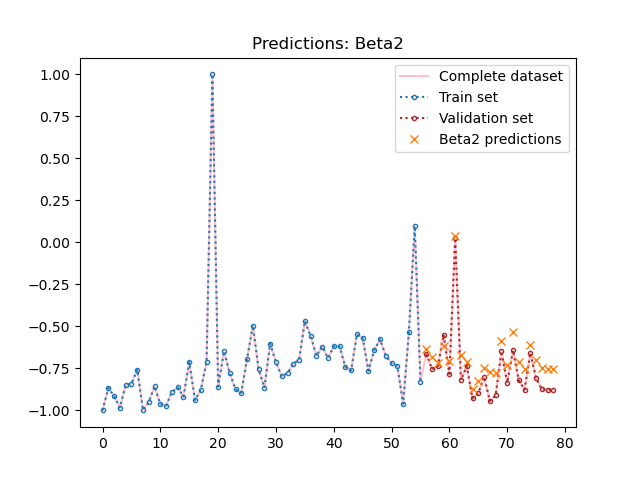

# Analisi di eeg come serie temporali

## Dati

I dati sono stati registrati durante un ciclo di terapia effettuato durante 78 sedute, su 7 soggetti. Per ognuna delle quali sono stati registrati i valori medi relativi a 10 parametri:

0. Alfa1
1. Alfa2
2. Beta1
3. Beta2
4. Delta
5. Gamma1
6. Gamma2
7. Theta
8. Meditazione (*calcolato*)
9. Attenzione (*calcolato*)

Questi sono stati estratti dall’onda eeg originale, isolando range di frequenze specifiche, tramite trasformata di Fourier. 

> **Nota.** I valori calcolati non dovrebbero aggiungere informazioni interessanti e quindi in un primo momento non li consideriamo.

> **Nota.** In questo momento i dati sono relativi unicamente a un paziente

### Plot

Per fare i primi ragionamenti sui dati e cominciare a “capirli”, si è scelto casualmente un paziente e si è fatto un grafico dei valori. 


Dato che notiamo degli spike anomali proviamo a farne un plot sovrapposto


Vediamo che gli spike sono diffusi sui vari canali, in questo momento può venire in mente siano causati da giornate particolari, errori di taratura degli strumenti ecc. va indagato ed è necessario capire se escluderli o attenuarli.

## Matrice di correlazione

Successivamente si è fatta una matrice di correlazione per iniziare a indagare i rapporti tra i valori e valutare se escludere parametri tra loro dipendenti.


## Scelta e preparazione dei parametri

Per queste prime prove è stato deciso di rimuovere i parametri calcolati, *attenzione* e *meditazione*, rimangono quindi

0. Alfa1
1. Alfa2
2. Beta1
3. Beta2
4. Delta
5. Gamma1
6. Gamma2
7. Theta

I parametri sono stati poi stati portati all’interno di un intervallo $[0,1]$ tramite `MinMaxScaler((-1, 1))`.


Si è provato anche ad applicare uno *Standard score* ma per ora sembra peggiorare i valori di training, verranno fatte ulteriori prove durante il fine tuning.

## Model

Di seguito `input_shape`, `target_shape` e model summary

```
Input shape: (1, 1, 8)
Target shape: (1, 1)

Model: "model"
_________________________________________________________________
Layer (type)                 Output Shape              Param #   
=================================================================
input_1 (InputLayer)         [(None, 1, 8)]            0         
_________________________________________________________________
lstm (LSTM)                  (None, 32)                5248      
_________________________________________________________________
dense (Dense)                (None, 1)                 33        
=================================================================
Total params: 5,281
Trainable params: 5,281
Non-trainable params: 0
_________________________________________________________________
```

## Training

I dati di training sono stati espansi tramite [`timeseries_dataset_from_array`](https://www.tensorflow.org/api_docs/python/tf/keras/preprocessing/timeseries_dataset_from_array), utilizzando i seguenti parametri

``` 
sequence_length = 1
sampling_rate = 1
sequence_stride = 1  
```

Sono perplesso sull’utilità di utilizzare una sliding window con questi parametri, mi aspetto il risultato finale sia equivalente alla sequenza iniziale. Qualsiasi altro parametro peggiorava notevolmente i risultati.

I parametri del training invece sono 

```
 learning_rate = 0.001
 batch_size = 1
 epochs = 100
```

## Training loss e predizioni

Come atteso, si nota una **correlazione** tra il numero delle epochs, la tendenza del training e validation loss e la qualità delle predizioni, questo è un buon segno.

L’accuratezza molto elevata delle predizioni, soprattutto nei canali *alfa1* e *alfa2* fa temere ci sia un problema nell’impostazione del problema, **la previsione era di non ottenere così buone predizioni**, con un dataset così limitato.

I canali *delta* e *theta* ad una prima lettura dei grafici di training e validation loss, sembrano presentare un problema di **overfitting**.

### Alfa1


### Alfa2


### Beta1


### Beta 2




### Delta


### Gamma1


### Gamma2


### Theta


## Conclusioni al 9/02/21

Alcune parti del processo non mi sono ancora del tutto chiare ma la cosa che più mi preoccupa sono alcune predizioni eccessivamente corrette. Temo possa essere stato impostato male il problema.

Prossimi passi:

- Mischiare dati di soggetti differenti
- Migliorare la consapevolezza sull’esperimento
- Automatizzare per ogni canale in ingresso
  - La produzione dei modelli e delle predizioni
  - La produzione dei plot
- Creare multiplot

## Categorizzazione e risoluzione di problemi

### Data una sequenza monodimensionale predirne il continuo

#### Dati

Array colonna di dati float
$$
dataset = (a_1, a_2, \dots, a_m)' = 

\begin{bmatrix} 
a_1 \\ a_2 \\ \vdots \\ a_m
\end{bmatrix}
$$

#### Model e train

Prendiamo i dati e scegliamo un indice $i$ che divida tra quelli che useremo per l’allenamento e quelli invece che useremo per la validazione
$$
\begin{align}
train &= (a_1, a_2, \dots, a_{i})' \\
val &= (a_{i+1}, a_{i+2}, \dots, a_m)'
\end{align}
$$
Sia per i dati di allenamento che per i dati di validazione, generiamo le variabili $input_{L}(x)$ e il $target_L(y)$, dove $L$ è la variabile di *lookback* che ci dice quanti elementi vengono tenuti in considerazione per indovinare l’elemento $a_{L+1}$-esimo
$$
\begin{align}
&\begin{cases}
input_1 &= (a_1, a_2, \dots, a_{m-1})' 
\\
target_1 &= (a_{2}, a_{3}, \dots, a_m)'
\end{cases}
\\
&\begin{cases}
input_2 &= 
((a_1, a_2), (a_2, a_3) \dots,(a_{n-2}, a_{m-1}) )' 
\\
target_2 &= (a_{3}, a_{4}, \dots, a_m)'
\end{cases}
\\
&\vdots
\\
&\begin{cases}
input_L &= ((a_1, a_2, \dots, a_{L}),\dots,((a_{m-L}, a_{m-(L-1)}, \dots, a_{m-2}, a_{m-1})) )' 
\\
target_L &= (a_{L+1}, \dots, a_m)'
\end{cases}
\end{align}
$$
in forma matriciale
$$
\begin{array}{}

I^{(m-L) \times (L)} = 
\begin{pmatrix}
a_1 & a_2 & \dots & a_{L-1} & a_{L} \\
a_2 & a_3 & \dots & a_{L} & a_{L+1} \\
a_3 & a_4 & \dots & a_{L+1} & a_{L+2} \\
\vdots & & & & \vdots\\
a_{(m-1)-L} & a_{(m-1)-(L-1)} & \dots & a_{m-3} & a_{m-2}\\
a_{m-L} & a_{m-(L-1)} &\dots & a_{m-2} &a_{m-1}
\end{pmatrix}

&
T^{m-L \times 1}=
\begin{pmatrix}
a_{L+1} \\
a_{L+2} \\
a_{L+3} \\
\vdots \\
a_{m-1} \\
a_{m} \\
\end{pmatrix}

\end{array}
$$

Il modello utilizzato è il seguente


```python
look_back = 1

model = Sequential()
model.add(LSTM(4, input_shape=(1, look_back)))
model.add(Dense(1))
model.compile(loss='mean_squared_error', optimizer='adam')
model.fit(trainX, trainY, epochs=100, batch_size=1, verbose=2)
```
